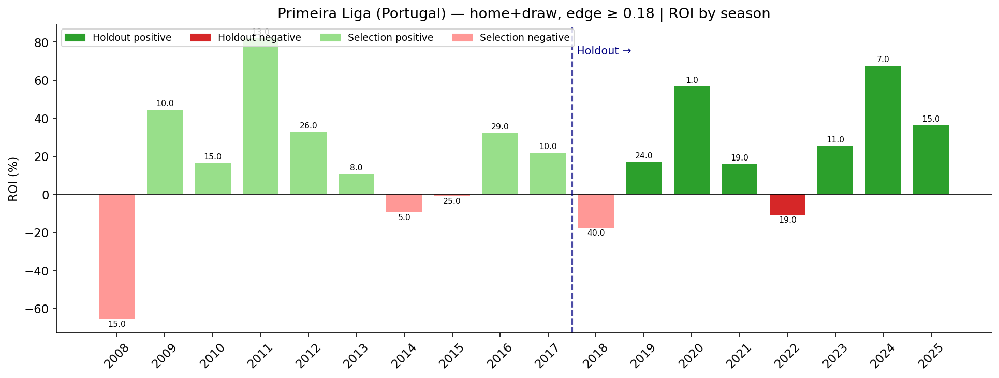
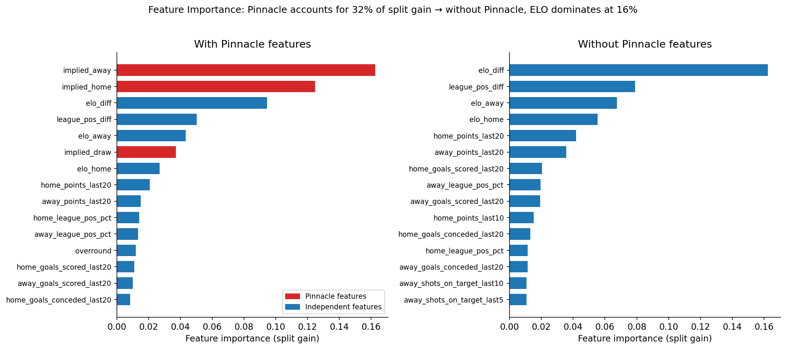
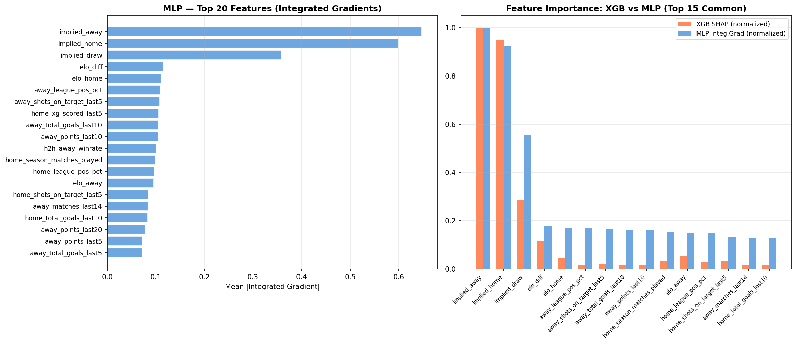
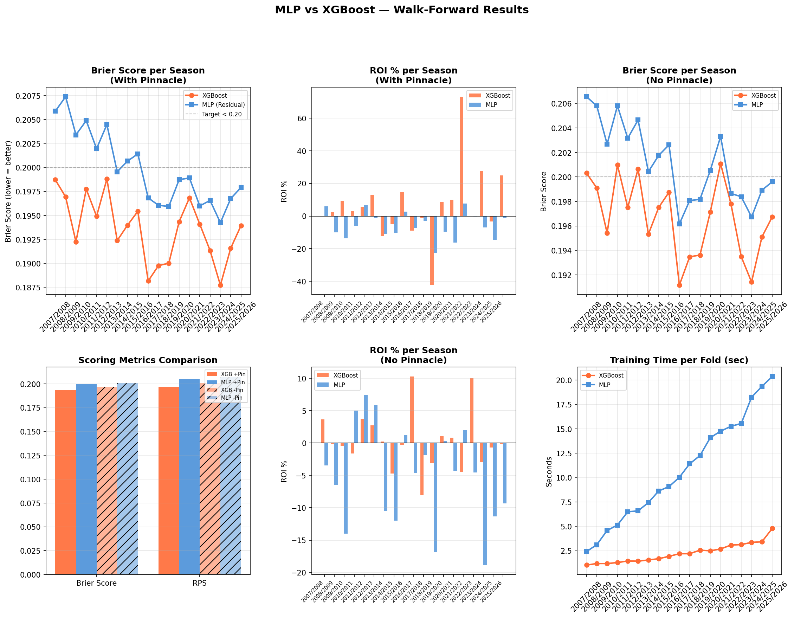

# Football Market Predictor


Finding systematic mispricings in European football betting markets using machine learning. Includes full ML/DL comparison: XGBoost vs Residual MLP (PyTorch) on 94k matches across 12 leagues and 20 seasons.

---

## Hypothesis

Pinnacle — the sharpest bookmaker in the world — prices odds based on long-term team reputation and public perception. When two teams have similar current ELO, similar recent form, and comparable xG output, but different reputations, the market still prices a clear favorite. I hypothesize this creates a systematic mispricing in home wins and draws, detectable via a model trained on current team strength rather than historical prestige.

The mispricing should be strongest in leagues with lower global visibility — where the market's American-skewed audience relies on reputation rather than current form.

---

## Data

73,469 matches across 12 European leagues (2006–2026) from football-data.co.uk. xG data for top-5 leagues from Understat API (21,126 matches). Implied probabilities from Pinnacle closing line, converted to no-vig using standard normalization.

---

## Method

**Features (85 total).** ELO ratings with per-league decay, rolling goals/xG/points over last 5/10/20 matches, draw rate, clean sheet rate, H2H, league position, season stage, Dixon-Coles attack/defense parameters, Pinnacle implied probabilities.

**Model.** XGBoost classifier optimized on log-loss. Hyperparameters tuned with Optuna (100 trials per fold):

```
n_estimators:     725      max_depth:        3
learning_rate:    0.010    subsample:        0.602
min_child_weight: 10       reg_alpha:        0.999
```

Optuna consistently selected a conservative configuration — shallow trees, strong L1 regularization, small learning rate — to avoid overfitting across 12 leagues and 20 seasons.

**Validation.** Walk-forward: train on all past seasons, test on the next one. 19 folds total, no leakage. Each fold runs its own Optuna tuning — saved hyperparameters reflect the last fold only, not an average. Benchmark is Pinnacle closing line.

**Signal.** Edge = model probability − Pinnacle implied probability. Kelly sizing with quarter-Kelly and 10% bankroll cap per bet.

---

## Results

Overall model quality across all leagues and bets:

| Metric | Score | Target |
|---|---|---|
| Brier Score | 0.199 | < 0.21 |
| RPS | 0.203 | < 0.202 |
| Overall ROI (all bets, edge ≥ 0.08) | +2.0% | — |

Uniform performance is not the goal. The edge is concentrated in specific leagues and outcome types, found through grid search on 2006–2018 data and validated on 2019–2026 holdout.

**Primeira Liga (Portugal) — home wins and draws — edge ≥ 0.18:**

| Metric | Selection 2006–2018 | Holdout 2019–2026 |
|---|---|---|
| ROI | +10.1% | +19.6% |
| Positive seasons | 10 / 13 | 6 / 7 |
| Bets per season | ~15 | ~14 |



---

## Ablation: Pinnacle as Feature

During analysis I identified that Pinnacle implied probabilities were included as model features. This is a potential source of leakage: the model could learn to replicate Pinnacle rather than find independent signal.

Feature importance confirmed Pinnacle columns account for ~32% of XGBoost split gain. To test the impact, I ran the full pipeline a second time with Pinnacle columns removed from features entirely — same architecture, same Optuna budget, same walk-forward.

Results for key strategies:

| Strategy | With Pinnacle | Without Pinnacle | Verdict |
|---|---|---|---|
| Primeira Liga (Portugal) home+draw ≥ 0.18 | +13.8% ROI | +11.1% ROI | Stable — real signal |
| Bundesliga (Germany) draw ≥ 0.25 | +31.9% ROI | −10.5% ROI | Leakage artifact |
| Super League (Greece) draw ≥ 0.15 | −25.2% ROI | +12.4% ROI | Pinnacle was masking signal |

**Key finding:** Portugal's edge survives removal of Pinnacle features. Bundesliga (Germany) edge collapses. This distinguishes real signal from noise around Pinnacle's predictions.

Without Pinnacle, the model shifts toward draw markets in lower-profile leagues — Greece, Netherlands, Portugal — where ELO and form genuinely outperform market pricing. This matches the original hypothesis about geographic bias.



---

## Strategy Comparison

All strategies evaluated on the same holdout period (2019–2026):

| Strategy | ROI | Sharpe | Bets/season | Pos seasons | p-value |
|---|---|---|---|---|---|
| **Primeira Liga (Portugal) home+draw ≥ 0.18** (with Pinnacle) | **+13.8%** | **0.579** | **16.2** | **13/18** | **0.021** |
| Primeira Liga (Portugal)+Super League (Greece)+Championship (England) home+draw ≥ 0.18 (with Pinnacle) | +10.3% | 0.099 | 36.8 | 12/19 | 0.006 |
| Bundesliga (Germany) draw ≥ 0.25 (with Pinnacle) | +31.9% | 0.606 | 6.9 | 6/8 | 0.091 |
| Primeira Liga (Portugal) home+draw ≥ 0.18 (no Pinnacle) | +11.1% | 0.387 | 21.1 | 12/18 | 0.060 |
| Super League (Greece)+Primeira Liga (Portugal) draw ≥ 0.15 (no Pinnacle) | +18.4% | 0.160 | 12.1 | 9/18 | 0.055 |
| Super League (Greece)+Eredivisie (Netherlands)+Primeira Liga (Portugal) draw ≥ 0.18 (no Pinnacle) | +5.9% | 0.322 | 9.9 | 10/18 | 0.298 |

---

## Final Strategy

**Primeira Liga (Portugal) — home wins and draws — edge ≥ 0.18**

| Metric | Value |
|---|---|
| ROI (holdout 2019–2026) | +13.8% |
| Sharpe ratio | 0.579 |
| Win rate vs market | 57.0% vs 51.4% |
| p-value (binomial) | 0.021 |
| Positive seasons | 13 / 18 |
| Bets per season | ~16 |
| Survives Pinnacle ablation | Yes — ROI +11.1% without Pinnacle features |
| Deflated Sharpe Ratio | 0.433 (p = 0.033, N = 500 strategies tested) |

Why Portugal: the market's English-speaking, American-skewed audience prices well-known leagues (EPL, Bundesliga (Germany), La Liga) efficiently. Primeira Liga (Portugal) teams like Braga, Vitória, and Famalicão are less followed — current form and ELO signal is not fully priced in. The model exploits this gap.

---

## Decision Log

**Why not Bundesliga (Germany)?**
Bundesliga (Germany) draws showed +31.9% ROI with Pinnacle in features. After ablation the same strategy returned −10.5%. Pinnacle is extremely accurate on Bundesliga (Germany) — the model was finding noise around its predictions, not real signal. Dropped.

**Why not Super League (Greece)?**
Super League (Greece) draw without Pinnacle shows +12.4% ROI but p=0.19 and Sharpe 0.065. Seasonal breakdown reveals extreme variance: multiple seasons at −100%, one season at +93%, another at +104%. The positive mean is driven by two recent outlier seasons, not a consistent pattern. With only 8-9 bets per season, one cold streak eliminates several years of gains. Requires more data before inclusion.

**Why not Primeira Liga (Portugal) + Super League (Greece) + Championship (England) combined?**
Higher volume (37 bets/season) but Sharpe drops to 0.099 — Championship (England) and Greece add noise. Super League (Greece) is individually unstable, Championship (England) shows no consistent edge. Combining dilutes the Portugal signal.

**Why not LightGBM or CatBoost?**
Not benchmarked. On 73k rows with 85 mostly numeric features, quality difference between boosting frameworks is typically < 0.001 Brier Score. XGBoost with Optuna-tuned hyperparameters is sufficient. A comparison is left for future work.

**Why not average model weights across folds?**
Walk-forward is not a method for building a production model — it is a method for evaluating strategy. Each fold trains an independent model to test on its own season. A production model would be trained fresh on all available data with the latest hyperparameters.

**On the Pinnacle leakage:**
I identified that Pinnacle implied probabilities in the feature set create potential leakage: the model learns the Pinnacle output rather than independent signal. After running the full ablation, Portugal's edge proved robust — ROI drops from +13.8% to +11.1% but remains positive and directionally consistent. The leakage partially helped (calibration), partially hurt (masked real signals in Greece), and created false edge in Bundesliga (Germany).

---

## Metrics Used

**Brier Score** — mean squared error between predicted probabilities and outcomes. Lower is better. Penalizes confident wrong predictions.

**RPS (Ranked Probability Score)** — extension of Brier Score that accounts for the ordering of outcomes (home → draw → away). More appropriate for football than Brier Score alone.

**Sharpe Ratio** — mean seasonal ROI divided by standard deviation of seasonal ROI. Measures consistency, not just average return.

**Deflated Sharpe Ratio (DSR)** — Sharpe corrected for non-normality of returns and multiple comparisons (López de Prado, 2018). Grid search across ~500 strategy combinations inflates the chance of finding a spuriously profitable strategy. DSR penalizes for this. For the final Primeira Liga (Portugal) strategy: regular Sharpe 0.579 → DSR 0.433, p = 0.033. The strategy survives this test.

**p-value (binomial test)** — tests whether the observed win rate exceeds market-implied win rate by chance. Threshold: p < 0.05.

**ROI** — total profit divided by total staked. Computed on Kelly-sized bets, not flat stakes.

---

## Limitations

**ECE (Expected Calibration Error) is 0.12.** The model overestimates probabilities in absolute terms — predicts 0.85, actual rate is 0.61. This does not affect the strategy since edge is measured relative to Pinnacle, not in absolute terms. But it means Kelly sizing should be treated conservatively (quarter-Kelly or less).

**CLV (Closing Line Value) was not measured.** No timestamp data on when Pinnacle odds were recorded relative to match time. CLV is the standard professional metric for confirming real edge — without it, walk-forward ROI is the only validation.

That said, CLV is less critical here than in tight-margin strategies for three reasons. First, Primeira Liga (Portugal) is a low-liquidity market — line movement from opening to closing is smaller than in EPL or Bundesliga (Germany) because fewer sharp bettors are active. Second, Max odds across all bookmakers exceed Pinnacle by 0.11 on average in Primeira Liga (Portugal) — betting at the best available price rather than Pinnacle directly adds free edge. Third, the strategy's edge threshold of 0.18 is large enough to survive moderate line movement; strategies with edge 0.03–0.05 would be far more exposed to this risk.

The practical risk is different: Pinnacle limits winning accounts. The realistic execution path is to use soft bookmakers at odds close to Pinnacle closing line, until they restrict. This is standard for any sports betting strategy with real edge.

**70% max drawdown** with dynamic Kelly over 19 years. A single bad season can look like −30%. Requires capital allocation discipline.

**16 bets per season is a small sample.** p = 0.021 across 18 seasons is meaningful but one season of paper trading (~16 bets) will not be statistically conclusive on its own. Treat paper trading as qualitative validation, not proof.

---

## Next Steps

Paper trading on Primeira Liga (Portugal) — home wins and draws — edge ≥ 0.18 for one full season. Monitor whether edge vs Pinnacle persists in live conditions. Collect CLV data by recording both opening and closing lines.

---

## Deep Learning Comparison: Residual MLP vs XGBoost

Full research in [`experiments/08_mlp_vs_xgboost.ipynb`](experiments/08_mlp_vs_xgboost.ipynb).

### Architecture

Residual MLP (PyTorch): `Input → Linear(256) → ReLU → Dropout → ResBlock × 2 → Linear(64) → Linear(3)`  
Post-hoc calibration via Temperature Scaling (T learned on val set via LBFGS).  
Training: AdamW + Cosine Annealing with warm restarts (T₀=20) + label smoothing + early stopping.

### Results (walk-forward, 19 folds, 2006–2026)

| Model | Brier ↓ | RPS ↓ | ROI | Bets | +Seasons |
|---|---|---|---|---|---|
| **XGBoost + Pinnacle** | **0.1936** | **0.1969** | **+6.3%** | 1,181 | 12/19 |
| MLP + Pinnacle | 0.1998 | 0.2051 | −5.8% | 17,340 | 4/19 |
| XGBoost, no Pinnacle | 0.1966 | 0.2012 | +0.3% | 14,392 | 8/19 |
| MLP, no Pinnacle | 0.2011 | 0.2071 | −5.1% | 22,181 | 6/19 |

### Key Finding

MLP achieves comparable Brier Score (−6.2 millipoints vs XGBoost) but generates **15× more bets with negative ROI**. Small calibration errors compound into large losses under Kelly sizing. This demonstrates that prediction accuracy ≠ trading utility — calibration quality has outsized impact on bet sizing outcomes.

XGBoost's probability estimates are better calibrated for the Kelly criterion on this dataset. Temperature Scaling (T=1.42) partially corrects MLP overconfidence but is insufficient for aggressive Kelly sizing.

### Interpretability

- XGBoost: SHAP values (TreeExplainer)
- MLP: Integrated Gradients (Sundararajan et al., 2017)
- Both methods agree on top features: `elo_diff` > `implied_home/draw/away` > rolling form stats




---

## Structure

```
notebooks/
  football_market_predictor.ipynb  — full XGBoost research narrative
experiments/
  08_mlp_vs_xgboost.ipynb          — DL comparison: Residual MLP vs XGBoost
src/
  football_features.py             — feature engineering (ELO, rolling stats, xG)
  football_model.py                — XGBoost + walk-forward + Optuna tuning
scripts/
  collect_football_history.py      — data collection (football-data.co.uk)
  collect_xg_data.py               — xG data (Understat API)
  build_football_features.py       — feature matrix construction
  strategy_tester.py               — grid search over league/outcome/edge
  strategy_validation.py           — selection (2006–2018) vs holdout (2019–2026)
  overnight_pipeline.py            — full retraining pipeline (~3-4h)
data/
  raw/football/                    — match results + odds (parquet)
  processed/football_features.parquet  — feature matrix (94k × 85)
  results/                         — walk-forward predictions, figures, reports
```

---

## Stack

```
Python 3.12
pytorch, xgboost, optuna, scikit-learn, shap
pandas, numpy, scipy
Data: football-data.co.uk, Understat API
Validation: walk-forward cross-validation (19 folds)
```
